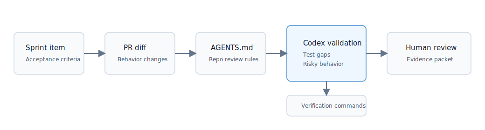

# Validate Sprint Items Before Human PR Review With Codex

## Purpose Of This Cookbook

AI coding tools can increase pull request volume, but review, testing, and release confidence do not automatically scale with it.

This cookbook shows a practical workflow for using Codex before human PR review:

1. Read a sprint item or ticket.
2. Extract acceptance criteria.
3. Inspect a PR diff.
4. Compare implementation against expected behavior.
5. Find risky behavior changes and missing tests.
6. Run or recommend verification.
7. Prepare a concise human review packet.
8. Save recurring review lessons into `AGENTS.md` or a reusable skill.

The goal is not to replace human reviewers. The goal is to give reviewers better evidence before they spend time on the PR.



## Flow

```text
sprint item ready for PR
-> acceptance criteria
-> PR diff
-> AGENTS.md repo rules
-> Codex validation
-> missing tests / risky behavior found
-> verification
-> focused fix
-> human review packet
-> reusable skill or AGENTS.md update
```

## Prerequisites

- Codex available in your local environment, IDE, or GitHub workflow.
- A pull request, branch, or pasted diff to inspect.
- Sprint item context with acceptance criteria.
- Repo-specific guidance in `AGENTS.md`.
- A test or verification command for the relevant part of the codebase.

For demo mode, this repo uses local markdown files:

- [../examples/sprint-item.md](../examples/sprint-item.md)
- [../examples/pr-diff.md](../examples/pr-diff.md)
- [../examples/codex-validation-output.md](../examples/codex-validation-output.md)
- [../examples/verification-output.md](../examples/verification-output.md)
- [../examples/final-human-review-packet.md](../examples/final-human-review-packet.md)
- [../demo/](../demo/)

In an enterprise deployment, the same context can come from Linear, Jira, GitHub Issues, Slack, a PRD, CI logs, and the actual PR diff.

## Run The Demo Locally

The demo repo is intentionally flawed so Codex has a real validation job.

Run:

```bash
cd demo
npm test
```

Expected before the focused fix:

```text
tests 4
pass 2
fail 2
```

The failing tests show that the PR misses the inclusive risk threshold and does not write an audit event when routing to manual review.

## Prepare Sprint Item Context

Start with a sprint item that has enough acceptance criteria to verify behavior. In the demo ticket, the team wants high-risk customer requests to require manual approval.

The key acceptance criteria are:

- Requests below risk score `80` continue automatically.
- Requests with risk score `80` or above require manual review.
- Manual-review requests are not processed automatically.
- Manual-review routing is written to the audit log.
- Tests cover low-risk, high-risk, and threshold-boundary behavior.

If the sprint item does not include acceptance criteria, ask Codex to extract assumptions and open questions before reviewing the PR.

```text
Read this sprint item and extract acceptance criteria, assumptions, non-goals, and open questions.
Do not inspect the PR yet.
```

## Add AGENTS.md Review Guidance

Codex review quality improves when repo-specific rules are explicit. Add a section like this to the relevant repo `AGENTS.md`. The demo version lives at [../demo/AGENTS.md](../demo/AGENTS.md).

```md
## Sprint PR Validation

When validating a PR against sprint-item acceptance criteria:

- Compare behavior against every acceptance criterion.
- Check threshold boundaries when numeric rules are introduced.
- Check audit logging when a new decision branch or status transition is introduced.
- Treat auth, permissions, data integrity, idempotency, and external side effects as risky surfaces.
- Passing CI is not enough if the new behavior lacks focused tests.
- Prepare a human review packet with verification evidence and remaining decisions.
```

This turns review expectations from implicit senior-engineer judgment into reusable context Codex can apply.

## Add The Reusable Skill

Use [../skills/sprint-pr-validation/SKILL.md](../skills/sprint-pr-validation/SKILL.md) when a PR or diff is ready for review and the team wants Codex to validate it against the sprint item before human review.

The skill asks Codex to:

- read the sprint item acceptance criteria
- inspect the PR diff
- apply `AGENTS.md` review guidance
- compare implementation against expected behavior
- find risky behavior changes
- identify missing tests
- run or recommend verification commands
- prepare a human review packet
- suggest reusable rule updates

## Ask Codex To Inspect The PR

Demo prompt:

```text
Use $sprint-pr-validation.

Validate this PR before human review.

Inputs:
- Sprint item: examples/sprint-item.md
- PR diff: examples/pr-diff.md
- Repo guidance: demo/AGENTS.md
- Demo source: demo/src/customerRequests.js
- Demo tests: demo/tests/customerRequests.test.js

Compare the PR against the acceptance criteria.
Identify missing tests, risky behavior changes, and verification gaps.
Prepare a human review packet.
```

Enterprise prompt:

```text
Use $sprint-pr-validation on PR #123.

Use the linked Linear issue as the source of acceptance criteria.
Apply AGENTS.md and package-specific review guidance.
Run the relevant test command if available.
Return acceptance criteria coverage, risky behavior changes, missing tests, verification evidence, and a human review packet.
```

## Compare Against Acceptance Criteria

Codex should produce a coverage table like this:

| Acceptance criterion | Status | Evidence |
| --- | --- | --- |
| Requests below `80` continue automatically | Covered | Existing low-risk path remains unchanged. |
| Requests `80` or above require manual review | Not covered | Diff uses `riskScore > 80`, excluding the threshold. |
| Manual-review requests are not processed automatically | Partially covered | Covered for `95`, not for `80`. |
| Manual-review routing is written to audit log | Not covered | High-risk branch returns before writing an audit event. |
| Tests cover boundary behavior | Not covered | Missing test for risk score `80`. |

This makes the review concrete. The reviewer can see which claims are supported by code and tests.

## Detect Missing Tests And Risky Behavior

The example PR looks clean but misses two important details:

- It uses `>` instead of `>=`, so a risk score of `80` is processed automatically.
- It does not create an audit event when the request is routed to manual review.

Codex should flag both because the sprint item explicitly says the threshold is inclusive and auditability is required.

Risk categories to check:

- threshold boundaries
- state transitions
- audit logging
- auth and permissions
- idempotency
- concurrency
- data integrity
- external side effects
- downstream compatibility

## Run Verification

Codex should run the relevant tests when available:

```bash
cd demo
npm test
```

If tests cannot be run, Codex should say why and provide the command a human should run.

Example failing output before the fix:

```text
FAIL demo/tests/customerRequests.test.js

processCustomerRequest
  ✓ processes low-risk requests automatically
  ✓ requires manual review for very high-risk requests
  ✕ requires manual review at the threshold
  ✕ writes an audit event when routing to manual review

Expected: "manual_review_required"
Received: "processed"
```

## Apply Focused Fixes

The fix should stay narrow:

```ts
if (request.riskScore >= MANUAL_REVIEW_THRESHOLD) {
  auditLog.push({
    requestId: request.id,
    action: "manual_review_required",
    actor: "system",
    createdAt: new Date().toISOString(),
  });

  return {
    ...request,
    status: "manual_review_required",
  };
}
```

Add focused tests for:

- `riskScore: 79` remains automatic
- `riskScore: 80` requires manual review
- manual-review routing writes an audit event

Avoid broad refactors during validation. The purpose is to make the PR reviewable, not to redesign the module.

The demo includes [../examples/focused-fix.diff](../examples/focused-fix.diff) so the exercise can be completed end-to-end after Codex identifies the issues.

## Prepare The Human Review Packet

Codex should return a final packet like [../examples/final-human-review-packet.md](../examples/final-human-review-packet.md).

The packet should include:

- sprint item
- acceptance criteria status
- verification command and result
- focused fixes applied or recommended
- remaining human decisions
- recommended reviewer focus
- reusable workflow lesson

This is the handoff point. Codex prepares evidence; the human reviewer decides whether to approve, request changes, or escalate.

## Save The Workflow As A Reusable Skill

If Codex finds a recurring lesson, update `AGENTS.md` or the skill.

Example reusable lesson:

```md
When a PR introduces a numeric threshold, validate the boundary value explicitly.
When a PR introduces a new decision branch or status transition, check whether an audit event is required.
```

This is where a one-off Codex review becomes a team workflow. The next PR benefits from what the team learned in this one.

## Conclusion

AI coding changes the review problem. Teams do not only need faster code generation; they need better evidence before human review.

This workflow gives Codex a bounded job:

```text
compare the PR to the sprint item
find missing tests and risky behavior
run verification
prepare the reviewer
capture reusable lessons
```

That is a practical first pilot for enterprise teams adopting Codex across the SDLC.
